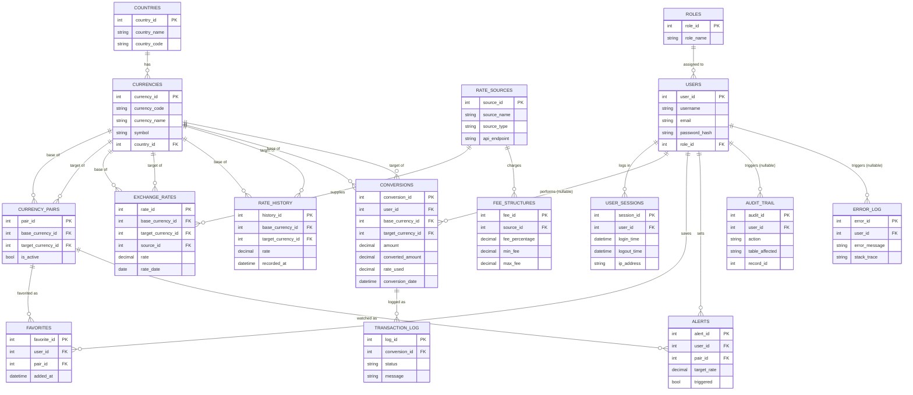

# Entity-Relationship Diagram & Normalization Notes

## ERD

## Normalization: 1NF → 2NF

**1NF.** Every table has a single-column, non-composite value per cell,
no repeating groups, and an explicit primary key. `currencies.symbol`
tempted a "list of symbols" design (some currencies have historical or
regional symbol variants); it was kept single-valued to stay in 1NF —
if that were ever needed, it would become its own child table.

**2NF.** 2NF only bites when a primary key is composite and a non-key
column depends on part of that key rather than the whole key. This
schema avoids that class of problem entirely by giving every table a
single-column surrogate PK (`*_id AUTO_INCREMENT`), and expressing the
real-world composite business keys as `UNIQUE` constraints instead of
part of the PK. Three tables are where this decision actually matters:

- `currency_pairs` — the natural key is
  `(base_currency_id, target_currency_id)`. `is_active` depends on
  *both* columns together, not either alone, so it's a 2NF risk under
  a composite PK. `UNIQUE KEY uq_pair` enforces the same business rule
  without a composite key.
- `exchange_rates` — natural key
  `(base_currency_id, target_currency_id, rate_date)`. `rate` and
  `source_id` depend on all three together. Same fix:
  `UNIQUE KEY uq_rate_per_day`.
- `favorites` — natural key `(user_id, pair_id)`, enforced by
  `UNIQUE KEY uq_user_pair` so a user can't favorite the same pair
  twice, again without a partial-dependency risk from a composite PK.

Every other table already has a single natural identifying column (or
none at all beyond the surrogate key), so 2NF is automatic once 1NF
holds.

## Where this schema deliberately doesn't chase 3NF further

3NF asks that non-key columns depend on *nothing but* the key — no
column should be derivable from other columns in the same row. Two
places intentionally keep a derived value anyway, because the
alternative (recomputing it later) would corrupt an audit record:

- `conversions.converted_amount` and `conversions.rate_used` are both
  derivable from `amount * rate_used`, and `rate_used` itself
  duplicates whatever `exchange_rates.rate` was at the time. Removing
  the duplication and instead joining back to `exchange_rates` would
  break the moment that day's rate is corrected or a new rate is
  inserted for the same day — the historical conversion would silently
  change. Storing the rate actually used, at the time it was used, is
  the entire point of an audit-style table, so this is kept
  denormalized on purpose.
- `rate_history` duplicates `exchange_rates` in the same way, as an
  append-only log rather than a "current state" table. `exchange_rates`
  answers "what's the rate right now"; `rate_history` answers "what was
  it at every point we recorded it." They're allowed to overlap because
  they answer different questions, not because of a normalization gap.

Everywhere else (currencies, users, roles, rate sources, pairs), the
schema holds to 3NF: every non-key column depends only on that table's
key, with no column re-derivable from another column in the same row.
